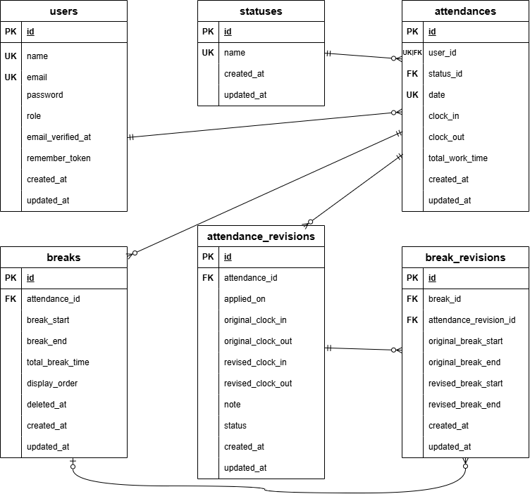

# coachtech勤怠管理アプリ（Attendance-laravel）

## 環境構築

### Dockerビルド
1. `git clone https://github.com/imachanimachan/Attendance-laravel`
2. DockerDesktopアプリを立ち上げる
3. `docker-compose up -d --build`

### laravel環境構築

1. `docker-compose exec php bash`
2. `composer install`
3. .env.exampleファイルから.envを作成し、以下の環境変数を追加
```
cp .env.example .env
```

```
DB_CONNECTION=mysql
DB_HOST=mysql
DB_PORT=3306
DB_DATABASE=laravel_db
DB_USERNAME=laravel_user
DB_PASSWORD=laravel_pass
```

4. アプリケーションキーの作成
``` bash
php artisan key:generate
```

5. マイグレーションの実行
``` bash
php artisan migrate
```

6. シーディングの実行
``` bash
php artisan db:seed
```
実行後以下のダミーデータが作成されます。
以下のアカウントでログインが可能です。

``` bash
1．ユーザー情報

    ＜一般ユーザー＞
    name：Test User
    email：test@example.com
    password：test1234

    ＜管理者ユーザー＞
    name：Admin User
    email：admin@example.com
    password：admin1234


1．勤怠記録情報

以下のような勤怠レコードが複数件作成されます（一部抜粋）

    出勤：2025-09-05 09:00:00
    休憩入り：2025-09-05 12:00:00
    休憩終わり：2025-09-05 13:00:00
    退勤：2025-09-05 18:00:00
```

### メール認証機能について

このアプリでは、メール認証が完了しないとログインできない仕様になっています。
Mailhog を使用してメールの確認を行います。

#### Mailhog

Mailhog はこのプロジェクトに Docker コンテナとして組み込まれており、インストールする必要はありません。

#### 導入手順

1. `.env` ファイルに以下の環境変数を追加してください。
```
MAIL_MAILER=smtp
MAIL_HOST=mailhog
MAIL_PORT=1025
MAIL_USERNAME=null
MAIL_PASSWORD=null
MAIL_ENCRYPTION=null
```
2. Docker を起動

```
docker-compose up -d
```

3. Docker 起動後、以下のURLから Mailhog にアクセスできます。
   http://localhost:8025

### テスト実行手順

1. テスト用データベースを作成

 MySQL コンテナにログインし、demo_test データベースを作成します。
```
docker exec -it <mysqlコンテナ名またはID> bash
mysql -u root -p
CREATE DATABASE demo_test;
```

2. .env.testing の設定
.env.exampleファイルから.env.testingを作成し、以下の環境変数を追加してください。

```
cp .env.example .env.testing
```

```
APP_ENV=testing

DB_CONNECTION=mysql
DB_HOST=mysql
DB_PORT=3306
DB_DATABASE=demo_test
DB_USERNAME=yourname
DB_PASSWORD=yourpass
```

3. テスト用のアプリケーションキーを生成（初回のみ）
```
php artisan key:generate --env=testing
```

4. テスト用データベースにマイグレーションを実行
```
php artisan migrate --env=testing
```

5. テストを実行
```
php artisan test
```

## 使用技術(実行環境)
- PHP8.4.3
- Laravel11.45.0
- MySQL8.0.26

## ER図


## URL
- 開発環境：http://localhost/
- phpMyAdmin：http://localhost:8080/
